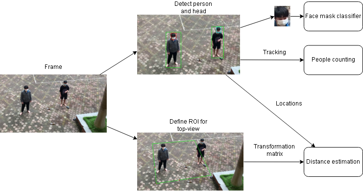

# 5(-2)K - Social distancing, face masks, and no gatherings
> _Covid-negative but positive in loving you <3._

## Abstract  
## Pipeline

## Installation  
1. Require Python 3.6+
2. Clone this repository
3. Go to src folder and run  
    `pip install -r requirements.txt`
## Usage  
1. Go to src/distance folder and run  
    ```bash
    python distance.py --video path
    ```

    First frame will be shown, then you have to click to choose 6 points:  
      - First 4 points are the top-left, top-right, bottom-left, bottom-right corners of the ROI.  
      - The last 2 points define distance in horizontal and vertical, which equals to 1 meter in the real world.  
    
    The result will to save to distance.txt.
1. Go to src folder and run   
    ```bash 
    bash demo.sh <video path> <limit number of people>  
    ```
    The result will be saved in `src\runs\track\test\<video name>`  
## Demo  

### Demo link:
| Google Colab demo |
|:-:|
|[](https://colab.research.google.com/drive/1wRSzvjsaP0NHlY9WtQ4KmgssU0zqfiJ-?usp=sharing)|
## Acknoledgements  
First, cam on giang vien.  

Second, allmost our code is borrowed from these resources:
1.  [YOLOv5](https://github.com/ultralytics/yolov5) and [deepakcrk's pretrained weights](https://github.com/deepakcrk/yolov5-crowdhuman) for head & person detection.
2.  [ByteTrack](https://github.com/ifzhang/ByteTrack) for tracking method.
   
Many thanks for their wonderful work.  

Finally, team spirit is the most important factor to win victory. Thank you for all your hảd wỏk. We did very well :>.
## Team members
- [Dinh Thi Thanh Huyen](https://github.com/dtthuyen)
- [Trinh Phan Mai Trang](https://github.com/Trang2101)
- [Duong Quang Tung](https://github.com/tungdop2)

## On-going work
- [x] Person and head detection
- [x] Add tracking method to improve detection performance
- [x] Face mask classifier
- [x] Top-view localization
- [ ] Optimize the face mask classifier
